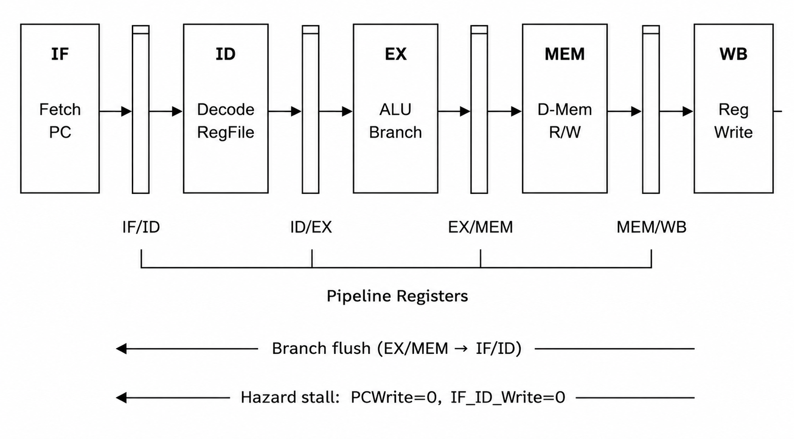
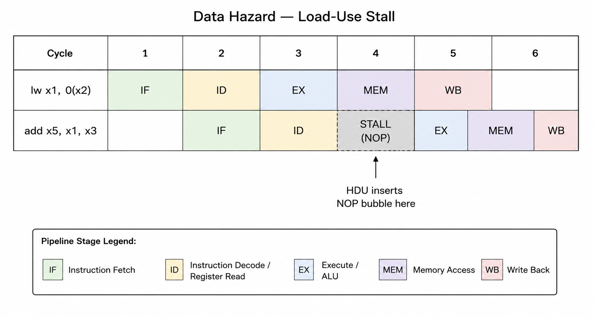

# 🔵 5-Stage RISC-V Pipelined Processor

<p align="center">
  
  
  
</p>

<p align="center">
  A fully functional <strong>5-stage pipelined RISC-V processor</strong> implemented in Verilog,  
  capable of executing a <strong>Bubble Sort algorithm</strong> with load-use hazard detection and branch flushing.
</p>

---


## 📋 Table of Contents

- [Overview](#overview)
- [Pipeline Architecture](#pipeline-architecture)
- [Project Structure](#project-structure)
- [Module Descriptions](#module-descriptions)
- [Hazard Handling](#hazard-handling)
- [Bubble Sort Algorithm](#bubble-sort-algorithm)
- [How to Simulate](#how-to-simulate)
- [Waveform Analysis](#waveform-analysis)
- [Performance Metrics](#performance-metrics)
- [Known Limitations](#known-limitations)

---

## Overview

This project implements a **classic 5-stage RISC-V pipeline** based on the RV32I base integer instruction set. The processor executes a Bubble Sort program that sorts a 10-element array in place, demonstrating:

- Instruction-level parallelism through pipelining
- Load-use data hazard detection and stalling
- Branch resolution with pipeline flushing
- Correct control signal propagation across all 5 stages

---

## Pipeline Architecture

## Block Diagram




### Stage Responsibilities

| Stage | Module | Function |
|---|---|---|
| **IF** | `InstructionFetch.v` | Fetch instruction from I-MEM, update PC |
| **ID** | `InstructionDecode.v` | Decode instruction, read registers, generate control signals |
| **EX** | `Execute.v` | ALU operation, branch decision, target address |
| **MEM** | `MemoryAccess.v` | Load/Store to data memory |
| **WB** | `WriteBack.v` | Write result back to register file |

---

## Project Structure

```
riscv-pipeline/
│
├── src/
│   ├── RISC_V_Pipelined_Processor.v   ← Top-level (start here)
│   ├── InstructionFetch.v              ← IF stage + I-MEM
│   ├── InstructionDecode.v             ← ID stage + Control Unit + RegFile
│   ├── Execute.v                       ← EX stage + ALU + Branch logic
│   ├── MemoryAccess.v                  ← MEM stage + D-MEM
│   ├── WriteBack.v                     ← WB stage
│   ├── PipelineRegisters.v             ← IF/ID, ID/EX, EX/MEM, MEM/WB
│   └── HazardDetectionUnit.v           ← Load-use stall detection
│
├── testbench/
│   └── testbench.v                     ← Self-checking simulation testbench
├── README.md
      └── pipeline_diagram.png
      └── data_hazard.png
└── Project report
```

---

## Module Descriptions

### `InstructionFetch.v`
- Holds a 64-word instruction memory pre-loaded with the bubble sort program
- PC increments by 4 each cycle
- On `PCSrc=1` (branch taken): loads `BranchTarget`
- On `PCWrite=0` (hazard stall): holds PC

### `InstructionDecode.v`
- **Register File:** 32 × 32-bit registers (x0 hardwired to 0)
- **Immediate Generator:** supports I-type, S-type, B-type formats
- **Control Unit:** combinational decode of 7-bit opcode into all control signals
- **ControlMux:** zeroes all control signals during a stall (inserts NOP bubble)

### `Execute.v`
- **ALU:** 32-bit, supports ADD, SUB, AND, OR, XOR, SLL, SLT
- **ALU Control:** decodes `ALUOp + Funct3 + Funct7` to select operation
- **Branch Logic:** evaluates `beq`, `bne`, `blt`, `bge`, `bltu`, `bgeu`
- **Branch Target:** `PC + Immediate` (immediate already byte-offset)

### `MemoryAccess.v`
- Separate 256-word data memory (no structural hazard with I-MEM)
- Array stored at byte address `0x200` (word address `0x80`)
- Synchronous write, asynchronous read

### `HazardDetectionUnit.v`
- Detects **load-use hazards** only (stall required — forwarding not implemented)
- Condition: `ID_EX_MemRead=1` AND `ID_EX_Rd ∈ {IF_ID_Rs1, IF_ID_Rs2}`
- Outputs: `PCWrite`, `IF_ID_Write`, `ControlMux`

### `PipelineRegisters.v`
- All four inter-stage registers in one file
- `IF/ID`: supports flush (branch) and stall (hazard)
- `ID/EX`, `EX/MEM`, `MEM/WB`: synchronous with reset

---

## Hazard Handling

### Data Hazard — Load-Use Stall




When detected:
- **PC** is held (not incremented)
- **IF/ID register** is held (same instruction re-decoded)
- **ID/EX register** gets zeroed control signals (NOP bubble)

### Control Hazard — Branch Flush

Branch outcome is known at the **end of EX stage** (stored in EX/MEM register). If branch is taken (`EX_MEM_PCSrc=1`):
- PC is redirected to `EX_MEM_BranchTarget`
- `IF/ID` register is flushed (2 instructions fetched speculatively are discarded)

---

## Bubble Sort Algorithm

The processor executes a 21-instruction RISC-V assembly bubble sort:

```asm
# Initialization
addi x22, x0, 0        # i = 0
addi x23, x0, 0        # j = 0
addi x10, x0, 10       # max = 10

# Loop1: Initialize array[0..9] = {0,1,2,...,9}
Loop1:
    slli x24, x22, 2       # byte offset = i * 4
    sw   x22, 0x200(x24)   # array[i] = i
    addi x22, x22, 1       # i++
    bne  x22, x10, Loop1

addi x22, x0, 0        # reset i = 0

# Loop2 (outer): for i = 0..9
Loop2:
    slli x24, x22, 2
    add  x23, x22, x0      # j = i

    # Loop3 (inner): for j = i..9
    Loop3:
        slli x25, x23, 2
        lw   x1,  0x200(x24)  # a[i]
        lw   x2,  0x200(x25)  # a[j]
        bge  x1,  x2, EndIf   # if a[i] >= a[j]: skip swap

        # Swap
        add  x5,  x1, x0      # temp = a[i]
        sw   x2,  0x200(x24)  # a[i] = a[j]
        sw   x5,  0x200(x25)  # a[j] = temp

    EndIf:
        addi x23, x23, 1
        bne  x23, x10, Loop3
    addi x22, x22, 1
    bne  x22, x10, Loop2
```

### Instruction Encoding (hex)

| PC | Hex | Assembly |
|---|---|---|
| 0x00 | `00000B13` | addi x22, x0, 0 |
| 0x04 | `00000B93` | addi x23, x0, 0 |
| 0x08 | `00A00513` | addi x10, x0, 10 |
| 0x0C | `002B1C13` | slli x24, x22, 2 |
| 0x10 | `036C2023` | sw x22, 0x200(x24) |
| 0x14 | `001B0B13` | addi x22, x22, 1 |
| 0x18 | `FEAB1EE3` | bne x22, x10, Loop1 |
| ... | ... | *(see InstructionFetch.v for full encoding)* |

---

## How to Simulate

### Option A — ModelSim (recommended)

```tcl
# In ModelSim console:
vlib work
vlog src/InstructionFetch.v
vlog src/InstructionDecode.v
vlog src/Execute.v
vlog src/MemoryAccess.v
vlog src/WriteBack.v
vlog src/PipelineRegisters.v
vlog src/HazardDetectionUnit.v
vlog src/RISC_V_Pipelined_Processor.v
vlog testbench/testbench.v
vsim testbench
add wave -r /*
run 6000ns
```

### Option B — Icarus Verilog + GTKWave (free/open-source)

```bash
# Compile
iverilog -o riscv_sim \
  src/InstructionFetch.v \
  src/InstructionDecode.v \
  src/Execute.v \
  src/MemoryAccess.v \
  src/WriteBack.v \
  src/PipelineRegisters.v \
  src/HazardDetectionUnit.v \
  src/RISC_V_Pipelined_Processor.v \
  testbench/testbench.v

# Run simulation
vvp riscv_sim

# View waveforms
gtkwave riscv_pipeline.vcd
```

### Expected Output

```
==============================================
 RISC-V 5-Stage Pipeline — Bubble Sort Test
==============================================
[20 ns] Reset released. Execution started.
...
[6000 ns] Simulation complete.
----------------------------------------------
 Final sorted array (data_memory[0x80..0x89]):
----------------------------------------------
  a[0] = 0
  a[1] = 1
  a[2] = 2
  a[3] = 3
  a[4] = 4
  a[5] = 5
  a[6] = 6
  a[7] = 7
  a[8] = 8
  a[9] = 9
----------------------------------------------
```

---

## Waveform Analysis

### Signals to observe in ModelSim/GTKWave

| Signal | Description |
|---|---|
| `clk`, `reset` | Clock and reset |
| `processor/PC` | Program Counter |
| `processor/Instruction` | Current instruction word |
| `processor/EX_MEM_PCSrc` | Branch taken signal |
| `processor/PCWrite` | Stall: PC frozen when 0 |
| `processor/ControlMux` | Stall: NOP inserted when 1 |
| `processor/ID_stage/registers[22]` | x22 — outer loop counter (i) |
| `processor/ID_stage/registers[23]` | x23 — inner loop counter (j) |
| `processor/MEM_stage/data_memory[128]` | a[0] in sorted array |
| `processor/EX_MEM_ALUResult` | Effective memory address |
| `processor/MEM_WB_RegWrite` | Register write-back enable |

### Key Waveform Events

1. **0–20 ns:** Reset active, all registers zeroed  
2. **20–120 ns:** Array initialization (Loop1), `sw` instructions writing 0..9  
3. **120 ns onwards:** Bubble sort comparison and swap loop begins  
4. **Stall bubbles:** Visible as PC staying constant for one cycle after `lw` before dependent instruction  
5. **Branch redirects:** `PCSrc` pulses HIGH, PC jumps back to loop head  

---

## Performance Metrics

| Metric | Value |
|---|---|
| Clock frequency | 100 MHz (10 ns period) |
| Total simulation time | ~6000 ns |
| Estimated instruction count | ~500 instructions |
| CPI (ideal) | 1.0 |
| CPI (actual) | > 1.0 due to stalls & branch penalties |
| Pipeline stages | 5 |
| Data memory size | 256 words (1 KB) |
| Instruction memory size | 64 words (256 B) |

---

## Known Limitations

| # | Limitation | Impact | Possible Fix |
|---|---|---|---|
| 1 | **No data forwarding** | Extra stall cycles for all data hazards | Add EX→EX and MEM→EX forwarding unit |
| 2 | **Branch resolved at EX/MEM** | 2-cycle branch penalty (2 wasted fetches) | Move resolution to ID stage or add branch predictor |
| 3 | **No exception/interrupt support** | Not usable in real embedded system | Add CSR registers and trap handling |
| 4 | **Fixed instruction memory** | Program cannot be changed at runtime | Replace with writable RAM + bootloader |

---

